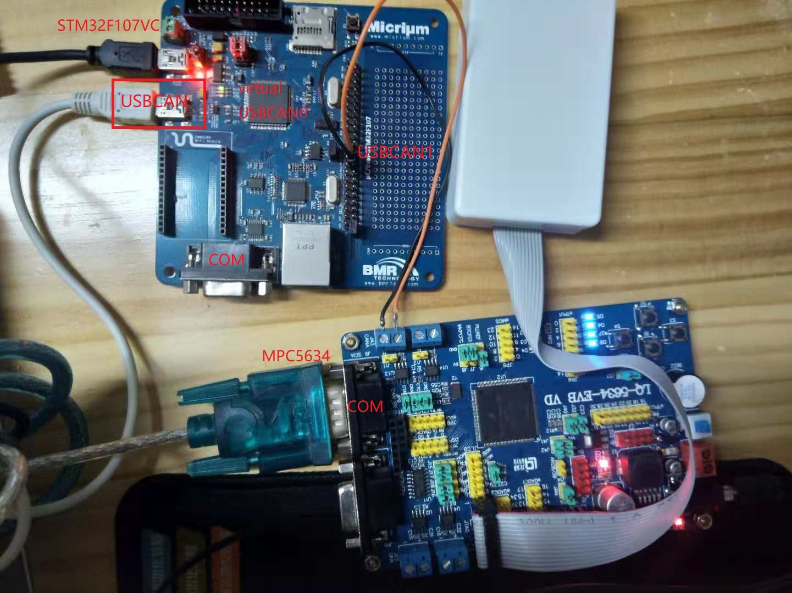
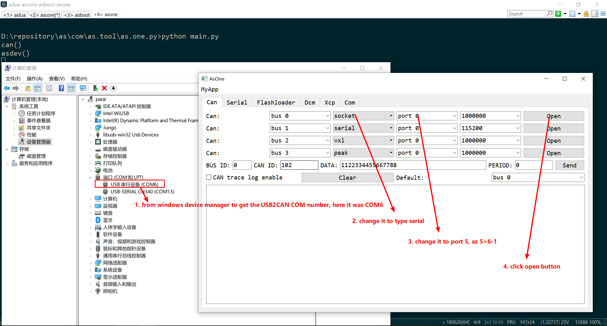
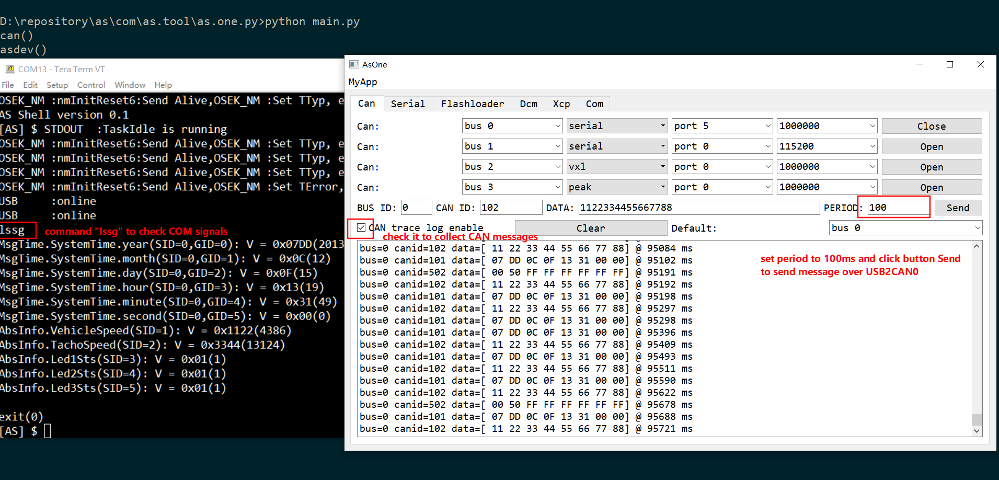
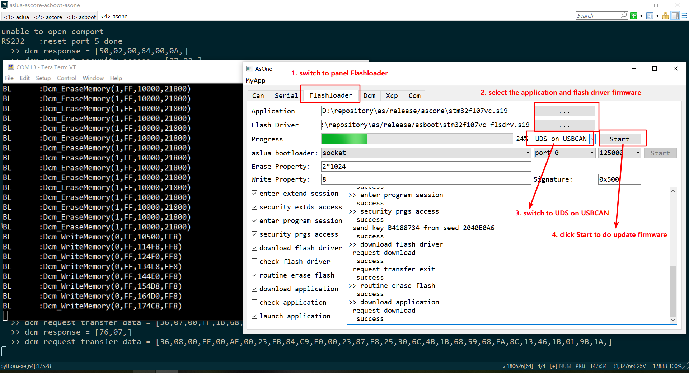
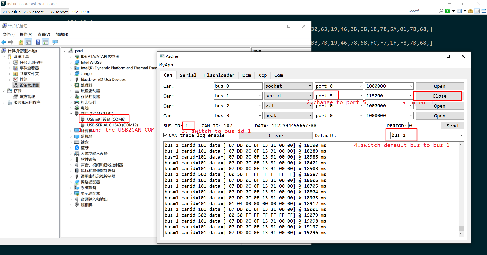
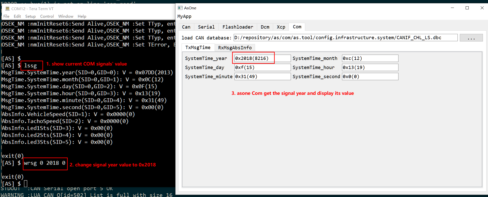
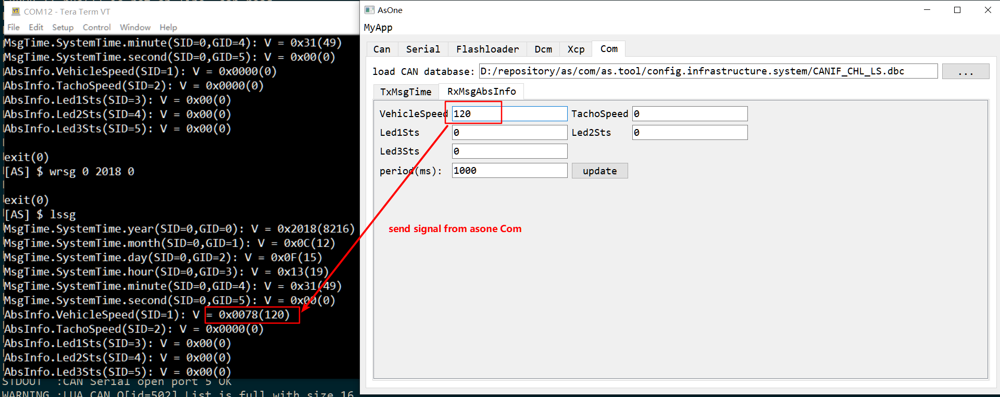
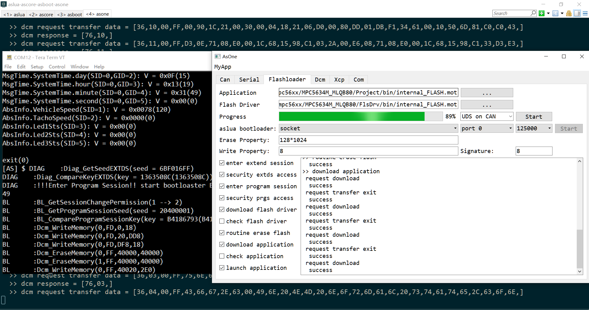

# AS USB2CAN

## I. Project Goal

This project is AS demo USB2CAN device built on stm32f107vc. The core of this project is based on the source code generated by STM32CubeMX and this project is part of [AS](https://github.com/parai/as).

This USB2CAN device implements 2 virtual CAN bus, the virtual CAN bus 0 will process the CAN mesages of the AUTOSAR COM stack, while the virtual CAN bus 1 will process the CAN messages on the real hardware CAN1. So that the virtual CAN bus 1 is a real USB2CAN device, let's name it USB2CAN1, and the virtual CAN bus 0 is a real virtualized CAN bus for the purpose to study AUTOSAR COM stack, let's name it USB2CAN0.

The goals of this project are:

* 1. USB2CAN0 for AUTOSAR COM stack study purpose.

* 2. USB2CAN1 is a real USB2CAN device like ZLGCAN, Vector CANcaseXL etc.

Limitations:

* 1. This USB2CAN is based on USB CDC serail protocol, no optimization.

* 2. The CAN baudrate is fixed to 1000Mbps, can't be dynamically changed.

## II. How to build and load firmware

Follow this page [as-study-platform](http://parai.github.io/as/autosar/2018/02/20/as-study-platform.html) to set up build environment.

* 1. Launch the J-Link GDB Server in the backgroud.

* 2. In the panel asboot of AS console, run below commands to build the asboot.

```sh
set BOARD=stm32f107vc
scons
```

* 3. In the panel ascore of AS console, run below commands to build the ascore.

```sh
set BOARD=stm32f107vc
scons
```

* 4. In the panel ascore of AS console, run below commands to flash firmware to target stm32f107vc

```sh
scons run
```

## III. Play with USB2CAN



In the panel of asone, run below command to launch the tool asone.

```sh
python main.py
```

### A. Play with USB2CAN0

#### 1. open USB2CAN0


#### 2. play AUTOSAR COM stack on USBCAN0


#### 3. update the stm32f107vc firmware over USBCAN0


### B. Play with USB2CAN1

#### 1. open USB2CAN1


#### 2. play AUTOSAR COM stack on USBCAN1



#### 3. update the mpc5634 firmware over USBCAN1

